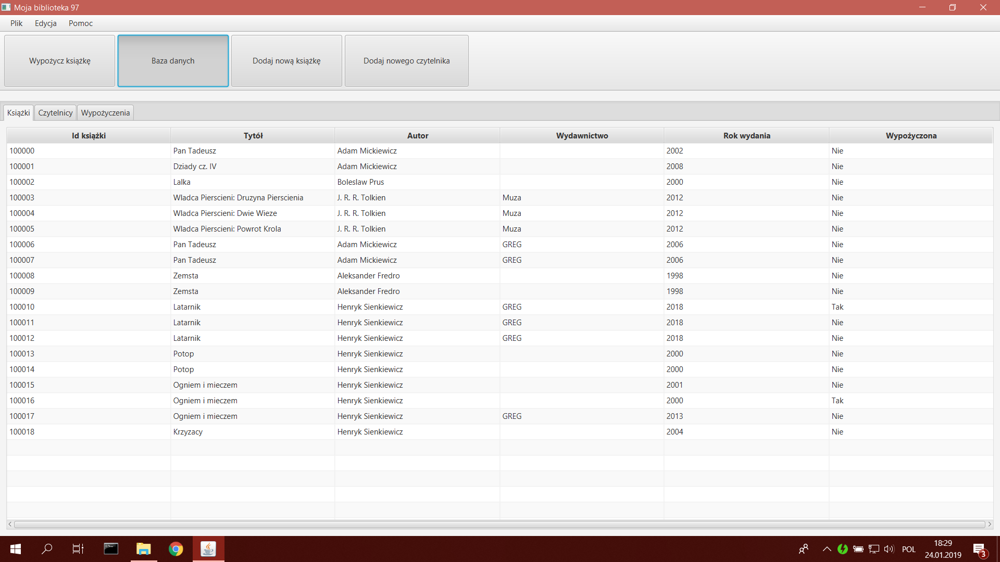
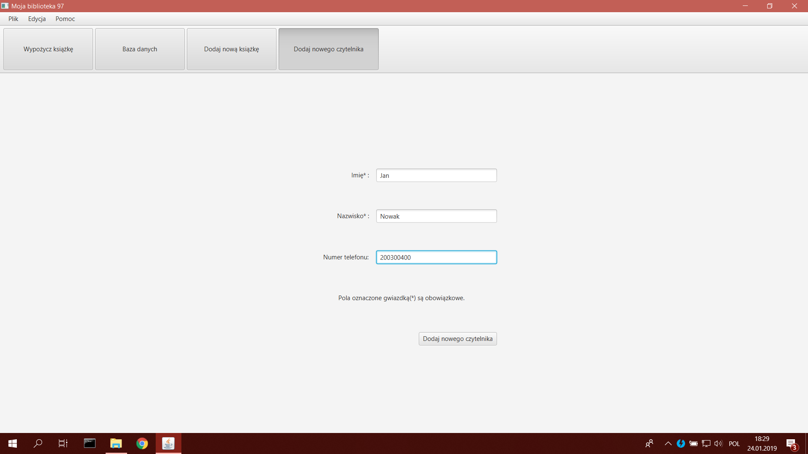
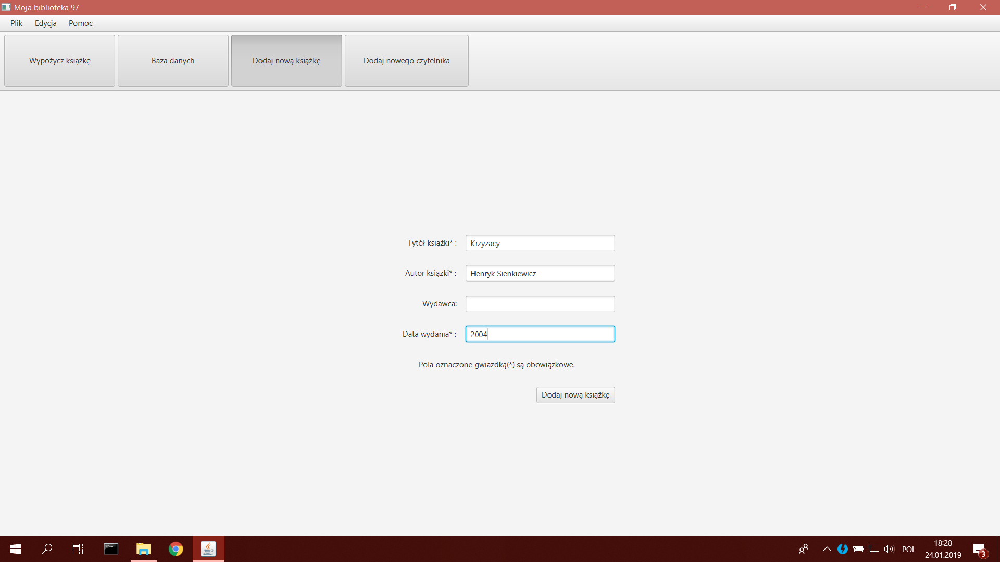
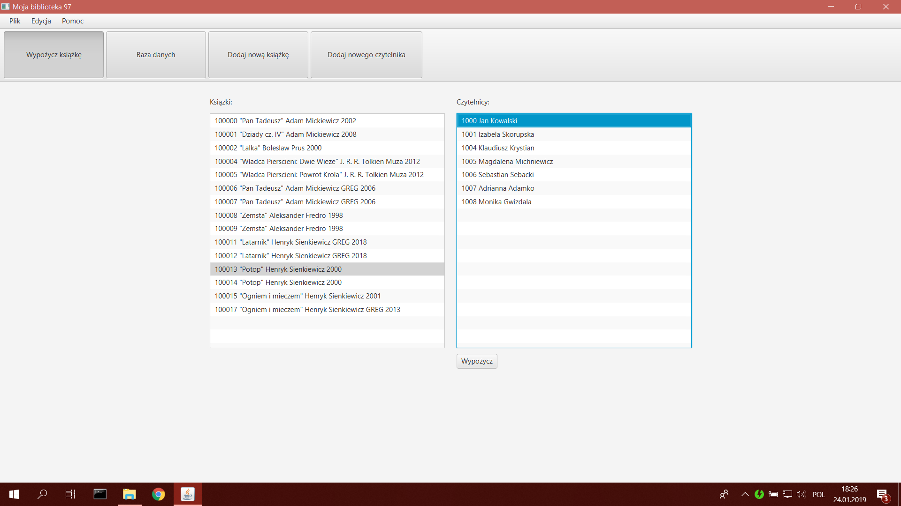
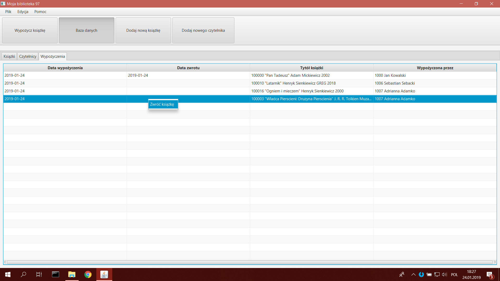
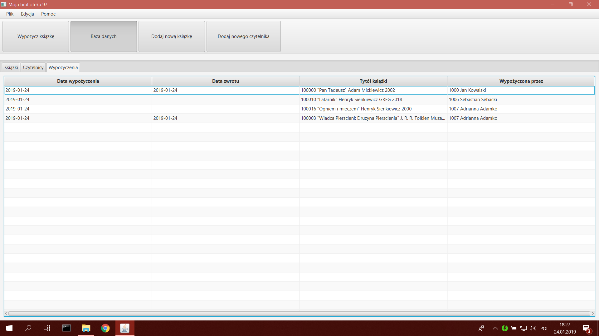

# projekt-Bezimienny197
-Moja biblioteka 97

## Spis treœci
* [Informacje ogólne](#informacje-ogólne)
* [Technologie](#technologie)
* [Screenshots](#screenhots)

## Informacje ogólne
### Tytó³ aplikacji: 
Moja Biblioteka 97

### Autor: 
Aleksander Szepelak

### Cel: 
Aplikacja ma pomagaæ w zarz¹dzaniu niewielk¹ bibliotek¹ (np. szkoln¹).

## Technologie
### Jêzyk: 
Aplikacja zosta³a napisana w jêzyku Java przy pomocy œrodowiska NetBeans IDE 8.2

###U¿yte biblioteki:
* Standardowa biblioteka Javy w wersji 8
* JavaFX w wersji 8.0.171
* Hibernate: ORM w wersji 4.3.1 oraz JPA w wersji 1.0.0
* MySQL-connector w wersji 5.1.23

## Screenshots
* Baza danych

* Dodawanie czytelnika

* Dodawanie ksi¹¿ki

* Wypo¿yczanie ksi¹¿ki

* Zwracanie ksi¹¿ki

* Po oddaniu
